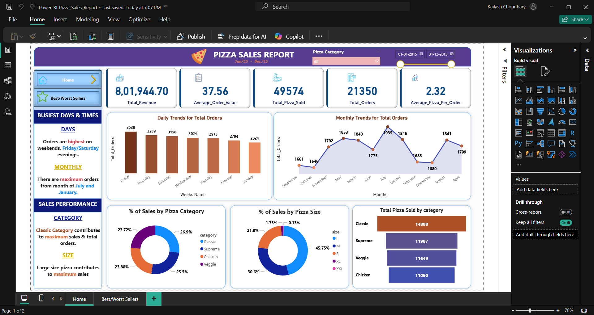

# 🍕 Pizza Sales Analysis

## 📌 Overview
An end-to-end pizza sales analysis combining SQL, Python, and Power BI to uncover sales trends, peak hours, best/worst-selling pizzas, and seasonal patterns — with actionable business recommendations.

---

## 🛠️ Tools & Technologies


---

## 🎯 Objectives
- Identify busiest days and peak hours for pizza orders
- Rank best and worst-selling pizzas by revenue
- Uncover seasonal trends in sales volume
- Calculate average order value and key business KPIs

---

## 📊 Dashboard Preview



---

## 🔑 Key Findings

| Insight | Finding |
|---|---|
| 📅 Busiest Day | Friday |
| ⏰ Peak Hours | Around Midday |
| 🏆 Best-Selling Pizza | Thai Chicken (`thai_ckn`) |
| 📉 Worst-Selling Pizza | Brie Carre (`brie_carre`) |
| 📆 Highest Sales Months | July & May |
| 💰 Average Order Value | $16.49 |

---

## 📁 Project Structure
```
Pizza_Sales/
│
├── orders.csv              # Order ID, date, and time
├── order_details.csv       # Pizza ID, quantity per order
├── pizzas.csv              # Pizza ID, size, price
├── pizza_types.csv         # Pizza name, category, ingredients
├── SQLQuery2.sql           # SQL queries for analysis
├── Pizza_sales.ipynb       # Python EDA notebook
├── Power-BI-Pizza_Sales_Report.pbix  # Power BI dashboard
├── image.png               # Dashboard screenshot
└── README.md
```

---

## 📂 Dataset Description

| File | Description |
|---|---|
| `orders.csv` | Order ID, date, and time of each order |
| `order_details.csv` | Pizza ID, quantity, and order ID |
| `pizzas.csv` | Pizza type ID, size, and price |
| `pizza_types.csv` | Pizza name, category, and ingredients |

---

## 💡 Recommendations
- Staff additional resources on **Fridays** and during **midday peak hours**
- Promote best-selling pizzas or introduce variations of `thai_ckn`
- Run targeted campaigns in **July and May** to capitalize on high-demand periods
- Review or discontinue underperforming items like `brie_carre`

---

## 🚀 How to Run

**SQL:** Open `SQLQuery2.sql` in SSMS or any SQL client and run against the CSV data

**Python:** 
```bash
pip install pandas matplotlib seaborn
```
Then open `Pizza_sales.ipynb` in Jupyter and run all cells

**Power BI:** Open `Power-BI-Pizza_Sales_Report.pbix` in Power BI Desktop

---

## 👤 Author
**Kailash Choudhary** | [LinkedIn](https://www.linkedin.com/in/kailashchoudharydata/) | [GitHub](https://github.com/KailasH1245)
